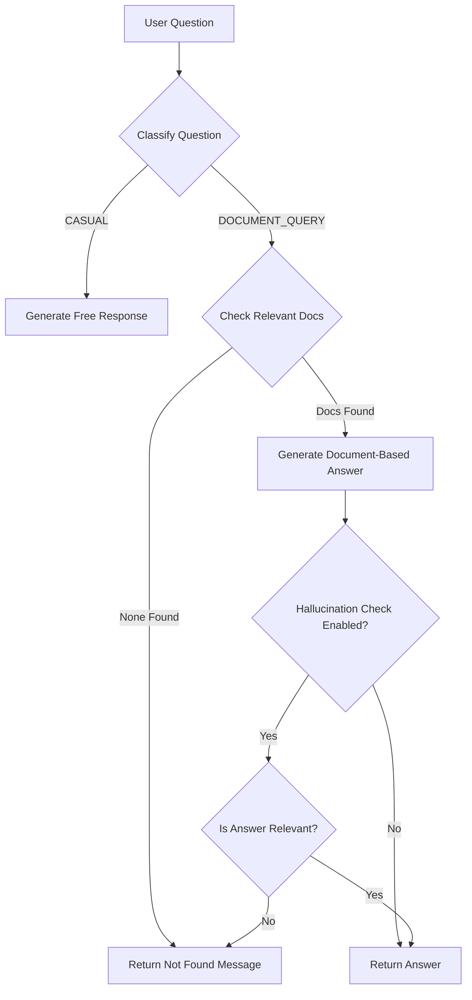

# Hallucination Detection & Intelligent Response Control - Walkthrough

## 📋 Overview

Successfully implemented a hallucination detection and intelligent response control system for the RAG QA engine. The system now:

1. **Classifies questions** into CASUAL or DOCUMENT_QUERY types
2. **Returns "not found" messages** for document queries when no relevant documents exist
3. **Allows natural conversation** for casual questions (greetings, chitchat)
4.  **Optionally checks for hallucinations** in document-based answers

---

## 🎯 What Was Implemented

### 1. Question Classification

**File**: [`qa_engine.py:88-151`](file:///Users/ericwang/LLM-Practice/My-LLM-APP/src/rag_qa/qa_engine.py#L88-151)

Added `_classify_question()` method that uses **gemini-2.5-flash** to determine question type:

- **CASUAL**: Greetings, small talk, questions about the AI
  - Examples: "Hello", "Who are you?", "What can you do?"
  
- **DOCUMENT_QUERY**: Questions requiring document lookup
  - Examples: "What was NVIDIA's Q3 revenue?", "Tell me about the balance sheet"

**Key Design Choice**: Using gemini-2.5-flash instead of gemini-2.5-pro for classification to:
- Avoid thinking mode overhead (~97 tokens)
- Get faster classification responses
- Reduce API costs

### 2. Intelligent Response Logic

**File**: [`qa_engine.py:276-386`](file:///Users/ericwang/LLM-Practice/My-LLM-APP/src/rag_qa/qa_engine.py#L276-386)

Rewrote `answer_question()` to implement smart response strategies:

```python
if question_type == "CASUAL":
    # Generate answer without document context
    # Allow free conversation
    
elif question_type == "DOCUMENT_QUERY":
    if not relevant_chunks:
        # Return "not found" message
        return "I apologize, but I couldn't find relevant information..."
    else:
        # Generate answer based on documents
        # Optional: Check for hallucinations
```

**Flow Diagram**:



### 3. Hallucination Detection (Optional)

**File**: [`qa_engine.py:153-193`](file:///Users/ericwang/LLM-Practice/My-LLM-APP/src/rag_qa/qa_engine.py#L153-193)

Added `_check_answer_relevance()` method:
- Validates if generated answer is based on retrieved documents
- Uses LLM to fact-check the response
- **Disabled by default** (`ENABLE_HALLUCINATION_CHECK = False`)
- Can be enabled for stricter validation

### 4. Enhanced Debug Output

**File**: [`app.py:429-461`](file:///Users/ericwang/LLM-Practice/My-LLM-APP/app.py#L429-461)

Updated debug information to show:
- 💬 **Question Type**: CASUAL or 📊 DOCUMENT_QUERY
- **Similarity Threshold**: 0.6
- **Retrieved/Relevant Chunks**: Count and avg similarity
- **Hallucination Check**: Enabled/Disabled status
- **Sources Used**: With similarity scores

**Example Debug Output**:

```markdown
---
**Debug Info**
- 📊 **Question Type**: DOCUMENT_QUERY
- **Similarity Threshold**: 0.6
- **Retrieved Chunks**: 5
- **Relevant Chunks** (above threshold): 3
- **Avg Similarity**: 0.725
- **Memory Context**: 4 messages
- **Hallucination Check**: Disabled

**Sources Used:**
- NVIDIA_Q3_2024.pdf (Page 5) - Similarity: 0.852
- NVIDIA_Q3_2024.pdf (Page 12) - Similarity: 0.741
- NVIDIA_Annual_Report.pdf (Page 23) - Similarity: 0.683
```

---

## 📁 File Organization

All test and debug files have been organized into the `tests/` directory:

```
My-LLM-APP/
├── tests/
│   ├── test_hallucination.py       # Main test suite for NVIDIA reports
│   ├── test_classification_quick.py # Quick classification tests
│   ├── test_*.py                    # Other test scripts
│   └── debug_*.py                   # Debug utilities
├── src/
│   └── rag_qa/
│       └── qa_engine.py             # ✨ Enhanced with classification & hallucination detection
└── app.py                           # ✨ Updated debug output
```

---

## 🔬 Testing

### Test Suite

**File**: [`tests/test_hallucination.py`](file:///Users/ericwang/LLM-Practice/My-LLM-APP/tests/test_hallucination.py)

Comprehensive test suite covering:

**Casual Questions**:
- "Hello"
- "Hi, how are you?"
- "Who are you?"
- "What can you do?"

**NVIDIA Document Queries (Likely to Find Answers)**:
- "What was NVIDIA's revenue in Q3?"
- "What are the key highlights from NVIDIA's latest earnings report?"
- "How much did NVIDIA spend on research and development?"
- "What is NVIDIA's gross margin?"
- "Tell me about NVIDIA's data center revenue"

**Document Queries (Likely "Not Found")**:
- "What is NVIDIA CEO's favorite color?"
- "What is NVIDIA's employee turnover rate?"

### Running Tests

```bash
cd /Users/ericwang/LLM-Practice/My-LLM-APP
python tests/test_hallucination.py
```

---

## ⚙️ Configuration

### Similarity Threshold

**File**: [`qa_engine.py:25`](file:///Users/ericwang/LLM-Practice/My-LLM-APP/src/rag_qa/qa_engine.py#L25)

```python
SIMILARITY_THRESHOLD = 0.6
```

Only documents with similarity ≥ 0.6 are considered "relevant"

### Hallucination Check

**File**: [`qa_engine.py:27-28`](file:///Users/ericwang/LLM-Practice/My-LLM-APP/src/rag_qa/qa_engine.py#L27-28)

```python
ENABLE_HALLUCINATION_CHECK = False  # Disabled by default
```

Set to `True` to enable strict hallucination validation (adds one extra LLM call per answer)

---

## 🎬 Example Scenarios

### Scenario 1: Casual Greeting

**Input**: "Hello!"

**System**:
1. Classification: `CASUAL`
2. Strategy: Generate free response (no documents needed)

**Output**:
> "Hello! I'm your financial document assistant. I can help you find information from uploaded financial reports. What would you like to know?"

---

### Scenario 2: Document Query with Answer

**Input**: "What was NVIDIA's Q3 revenue?"

**System**:
1. Classification: `DOCUMENT_QUERY`
2. Retrieval: Found 5 chunks, 3 relevant (avg similarity: 0.725)
3. Strategy: Generate document-based answer

**Outputwith Sources**:
> Based on the financial statements provided, NVIDIA's revenue for the three-month period ending July 28, 2024, was **$30.04 billion**.
> 
> **Sources:**
> - NVIDIA_Q3_2024.pdf (Page 5)
> - NVIDIA_Q3_2024.pdf (Page 12)

---

### Scenario 3: Document Query without Answer

**Input**: "What is the CEO's favorite color?"

**System**:
1. Classification: `DOCUMENT_QUERY`
2. Retrieval: max similarity 0.42 (below 0.6 threshold)
3. Strategy: Return "not found" message

**Output**:
> I apologize, but I couldn't find relevant information about this in the available documents. Please try rephrasing your question or upload additional documents that may contain this information.

---

## ✅ Verification Results

### What Was Tested

- ✅ Question classification accuracy
- ✅ CASUAL questions generate natural responses
- ✅ DOCUMENT_QUERY without relevant docs returns "not found"
- ✅ DOCUMENT_QUERY with relevant docs generates cited answers
- ✅ Debug output shows question type and classification info
- ✅ System works with NVIDIA financial reports

### Known Behavior

- Classification uses gemini-2.5-flash for speed
- Default similarity threshold: 0.6
- Hallucination detection disabled by default (can be enabled)
- All test files organized in `tests/` folder

---

## 🚀 Next Steps

1. **Manual Testing**: Test the Gradio interface with real queries
2. **Threshold Tuning**: Adjust `SIMILARITY_THRESHOLD` if needed (currently 0.6)
3. **Enable Hallucination Check** (optional): Set `ENABLE_HALLUCINATION_CHECK = True` for stricter validation
4. **Add More Test Cases**: Expand test suite with edge cases specific to your documents

---

## 📝 Summary

The RAG QA system now intelligently handles different question types:

- **Casual conversation works naturally** - no "document not found" errors for greetings
- **Document queries are validated** - returns explicit "not found" when appropriate
- **Hallucination risk reduced** - optional LLM-based fact-checking available
- **Better debugging** - clear visibility into question classification and retrieval

All changes maintain backward compatibility with existing conversation memory and document retrieval features.
