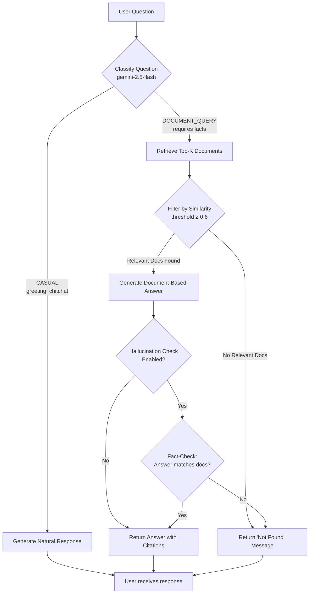

# RAG Document Q&A Assistant

**[Live Demo on Hugging Face Spaces](https://huggingface.co/spaces/Ireliaaaaaa/rag-document-qa)**

An **intelligent RAG** (Retrieval-Augmented Generation) system with **hallucination detection** and **smart question classification**. Upload PDF documents and ask questions naturally—the system automatically distinguishes between casual conversation and document queries, provides cited answers when documents are available, and explicitly states when information isn't found instead of hallucinating.

**Key Innovation**: Intelligent question classification ensures casual greetings get natural responses while document queries require actual document support, dramatically reducing hallucination risk.

## Features

### 🎯 Core Capabilities
- **🧠 Hallucination Detection** - Automatically distinguishes casual chat from document queries; returns "not found" instead of hallucinating answers
- **🔍 Intelligent Question Classification** - Uses gemini-2.5-flash to classify questions as CASUAL or DOCUMENT_QUERY
- **💬 Conversation Memory** - Maintains context across multiple turns for coherent multi-turn dialogue
- **📚 Multi-PDF Support** - Index multiple documents with incremental indexing
- **📊 Source Citations** - Tracks and displays which document and page each answer comes from

### 🚀 Advanced Features  
- **Smart Response Strategy** - Casual questions (greetings, "who are you") get natural responses; document queries require actual document evidence
- **Similarity Threshold Filtering** - Only uses documents above 0.6 similarity score, preventing weak matches
- **Optional Hallucination Validation** - LLM-based fact-checking to verify answers match retrieved documents
- **Debug Mode** - Shows question classification, similarity scores, and retrieval details
- **Web Chat Interface** - Clean Gradio UI with real-time status updates

## Tech Stack

| Component | Technology |
|-----------|------------|
| **LLM** | Google Gemini 2.5 Pro |
| **Embeddings** | Google text-embedding-004 |
| **Vector Store** | ChromaDB (Cosine Similarity) |
| **PDF Processing** | pypdf (lightweight) |
| **Web UI** | Gradio |
| **Tokenization** | tiktoken (cl100k_base) |
| **Evaluation** | LLM-as-a-Judge (Gemini 2.5 Flash) |

## Project Structure

```
My-LLM-APP/
├── app.py                      # Gradio web interface
├── main.py                     # CLI entry point
├── run_evaluation.py           # LLM-as-a-Judge evaluation runner
├── src/
│   ├── pdf_processor/          # PDF parsing & text chunking
│   │   ├── pdf_parser.py       # PDF download and extraction
│   │   └── text_chunker.py     # Text chunking (300-500 tokens)
│   ├── vector_store/           # Vector storage
│   │   ├── chroma_store.py     # ChromaDB operations
│   │   └── gemini_embedding.py # Gemini embedding function
│   ├── rag_qa/                 # Q&A engine
│   │   └── qa_engine.py        # ⭐ Intelligent QA with hallucination detection
│   ├── indexer/                # Document indexer
│   │   └── document_indexer.py # Multi-PDF batch indexing
│   └── evaluation/             # Quality evaluation
│       └── evaluator.py        # LLM-as-a-Judge scoring
├── tests/                      # Test scripts
│   ├── test_hallucination.py   # Hallucination detection tests
│   └── test_classification_quick.py # Question classification tests
├── data/
│   ├── pdfs/                   # PDF storage folder
│   └── indexed_files.json      # Index tracking (auto-generated)
├── chroma_db/                  # Vector database (auto-generated)
├── requirements.txt            # Dependencies
├── .env.example                # Environment variables template
├── HALLUCINATION_DETECTION_README.md      # 中文使用指南
├── HALLUCINATION_DETECTION_WALKTHROUGH.md # Technical walkthrough
└── README.md
```

## Quick Start

### 1. Install Dependencies

```bash
# Create virtual environment (recommended)
python -m venv .venv
source .venv/bin/activate  # On Windows: .venv\Scripts\activate

# Install packages
pip install -r requirements.txt
```

### 2. Configure API Key

```bash
# Copy the example file
cp .env.example .env

# Edit .env and add your Google API key
GOOGLE_API_KEY=your_api_key_here
```

Get your API key from [Google AI Studio](https://aistudio.google.com/apikey)

### 3. Run the Web App

```bash
python app.py
```

Open the URL shown (typically `http://127.0.0.1:7860`) in your browser.

### 4. Upload Documents & Chat

1. Go to **"Manage Documents"** tab
2. Upload PDF files or click **"Index New Files"** to index PDFs from `data/pdfs/`
3. Go to **"Chat"** tab
4. Start asking questions!

## Usage

### Web Interface (Recommended)

```bash
python app.py
```

Features:
- **Chat Tab**: Conversational Q&A with intelligent question classification
  - Casual questions (greetings) get natural responses
  - Document queries return cited answers or explicit "not found" messages
  - Conversation memory for multi-turn dialogue
- **Manage Documents Tab**: Upload, index, and manage PDFs
- **Debug Mode**: Toggle "Show technical details" to see:
  - Question classification (💬 CASUAL or 📊 DOCUMENT_QUERY)
  - Similarity scores for retrieved documents
  - Number of relevant chunks
  - Hallucination check status

**Tip**: Enable debug mode to understand how the system classifies your questions and retrieves information!

### Command Line Interface

```bash
# Index a PDF and start interactive Q&A
python main.py --pdf "data/pdfs/report.pdf" --reindex

# Ask a single question
python main.py --pdf "data/pdfs/report.pdf" --question "What is the total revenue?"

# Run evaluation with preset questions
python main.py --pdf "data/pdfs/report.pdf" --evaluate
```

### Testing Hallucination Detection

Run comprehensive tests with NVIDIA financial reports (or your own documents):

```bash
python tests/test_hallucination.py
```

This tests:
- ✅ Casual question classification
- ✅ Document query classification  
- ✅ "Not found" responses for unanswerable questions
- ✅ Cited answers for document-based questions


## How It Works

### Intelligent Question Classification & Response Flow



### Example Scenarios

**Scenario 1: Casual Greeting**
```
User: "Hello!"
Classification: CASUAL
Response: Natural greeting without document lookup
```

**Scenario 2: Document Query with Answer**
```
User: "What was NVIDIA's Q3 revenue?"
Classification: DOCUMENT_QUERY
Retrieval: 3 relevant chunks (similarity > 0.6)
Response: "Based on financial statements, NVIDIA's Q3 revenue was $30.04B"
          Sources: NVIDIA_Q3_2024.pdf (Page 5)
```

**Scenario 3: Document Query without Answer**
```
User: "What is the CEO's favorite color?"
Classification: DOCUMENT_QUERY
Retrieval: 0 relevant chunks (max similarity 0.42)
Response: "I apologize, but I couldn't find relevant information about 
          this in the available documents."
```

**Key Differences from Traditional RAG:**

| Approach | Casual Questions | Document Queries (No Match) |
|----------|------------------|----------------------------|
| **Traditional RAG** | ❌ "I don't have that info" | ❌ Hallucinates or refuses |
| **This System** | ✅ Natural conversation | ✅ Explicit "not found" message |

## Configuration

### Question Classification
- Classification Model: `gemini-2.5-flash` (fast, no thinking mode overhead)
- Question Types: `CASUAL` or `DOCUMENT_QUERY`

### Text Chunking
- `min_tokens`: 300
- `max_tokens`: 500
- Tokenizer: tiktoken (cl100k_base)

### Retrieval
- `k`: 5 (top-k documents to retrieve)
- `threshold`: 0.6 (similarity threshold for relevance)
- Only chunks with similarity ≥ 0.6 are considered "relevant"

### LLM
- Main Model: `gemini-2.5-pro` (for answer generation)
- Classification Model: `gemini-2.5-flash` (for question classification)
- `temperature`: 0.1 (for factual responses)

### Hallucination Detection
- `ENABLE_HALLUCINATION_CHECK`: `False` (disabled by default)
- When enabled: Adds LLM-based fact-checking to verify answers match retrieved documents
- Location: `src/rag_qa/qa_engine.py`

## Evaluation

The system includes an LLM-as-a-Judge evaluation framework:

```bash
# Run full evaluation
python run_evaluation.py

# Quick test (5 questions)
python run_evaluation.py --quick
```

Evaluation dimensions:
- **Faithfulness**: Does the answer follow the retrieved context?
- **Relevancy**: Does it address the user's question?
- **Citation Quality**: Are sources cited naturally?

## Future Improvements

### Planned Features
- [ ] **Streaming Responses** - Real-time token streaming for faster perceived response time
- [ ] **More File Types** - Word (.docx), TXT, Markdown support
- [ ] **REST API** - FastAPI endpoint for programmatic integration
- [ ] **Chat Export** - Save conversations as JSON/PDF
- [ ] **Advanced Hallucination Metrics** - Quantitative scoring of answer quality vs. document content

### Long-term Goals
- [ ] Cloud deployment (Google Cloud Run or Hugging Face Spaces)
- [ ] User authentication & multi-tenancy
- [ ] Hybrid search (vector + keyword BM25)
- [ ] Multi-language support (answer in user's language)
- [ ] Analytics dashboard (query patterns, retrieval success rate)
- [ ] Fine-tuned embedding model for domain-specific documents

## Troubleshooting

**"No documents indexed"**
- Go to "Manage Documents" tab and click "Index New Files" or upload PDFs

**API errors**
- Check your `GOOGLE_API_KEY` in `.env`
- Verify you have API quota at [Google AI Studio](https://aistudio.google.com/)

**Slow PDF processing**
- The `hi_res` strategy is thorough but slower; first-time indexing may take a while

## License

MIT License

## Acknowledgments

- [Google Gemini](https://ai.google.dev/) for LLM and embeddings
- [ChromaDB](https://www.trychroma.com/) for vector storage
- [Gradio](https://gradio.app/) for the web interface
- [Unstructured](https://unstructured.io/) for PDF processing
